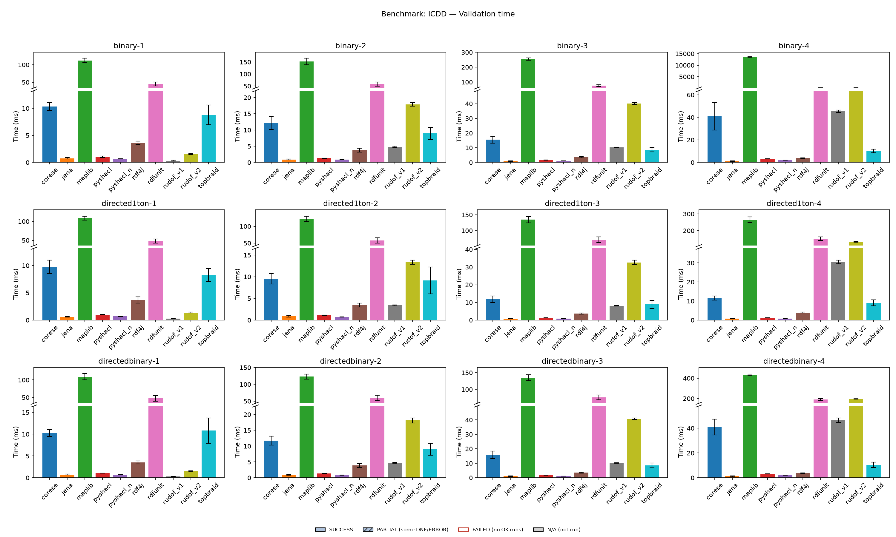
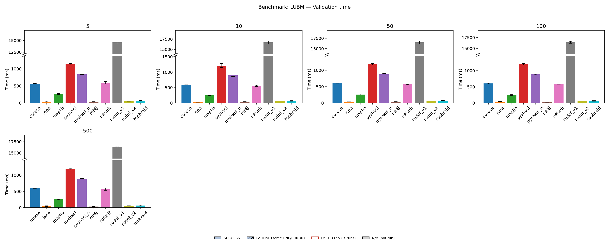

# Engines comparison results

The following results display the mean validation time (in milliseconds) of each engine for the benchmark cases.

## ERA

TBD

## ICDD

| Case | Jena | TopBraid | RDF4J | Corese | RDFUnit | maplib | pySHACL (N) | pySHACL | rudof v1 | rudof v2 |
|:------------------:|:-----:|:------:|:-----:|:------:|:-------:|:-------:|:-----:|:-----:|:------:|:-------:|
| `binary-1`         | 0.694 | 8.379  | 3.538 | 10.129 | 44.290  | 112.629 | 0.666 | 0.999 | 0.285  | 1.556   |
| `binary-2`         | 0.827 | 8.651  | 3.671 | 12.028 | 54.610  | 151.053 | 0.862 | 1.302 | 4.917  | 17.901  |
| `binary-3`         | 0.933 | 9.017  | 3.622 | 15.142 | 79.042  | 258.504 | 1.061 | 1.637 | 10.380 | 40.023  |
| `binary-4`         | 1.140 | 10.514 | 3.715 | 39.103 | 183.045 | 13 541  | 2.020 | 3.123 | 45.219 | 196.452 |
| `directed1ton-1`   | 0.620 | 7.853  | 3.551 | 9.743  | 47.942  | 109.015 | 0.681 | 0.998 | 0.262  | 1.365   |
| `directed1ton-2`   | 0.865 | 7.907  | 3.505 | 9.607  | 56.886  | 126.512 | 0.733 | 1.077 | 3.397  | 13.268  |
| `directed1ton-3`   | 0.757 | 8.402  | 3.615 | 11.915 | 68.471  | 132.481 | 0.872 | 1.323 | 8.035  | 32.560  |
| `directed1ton-4`   | 0.744 | 9.488  | 3.895 | 11.197 | 156.362 | 258.974 | 0.859 | 1.236 | 30.718 | 133.839 |
| `directedbinary-1` | 0.718 | 10.831 | 3.452 | 10.188 | 43.053  | 111.532 | 0.702 | 1.044 | 0.287  | 1.468   |
| `directedbinary-2` | 0.887 | 8.384  | 3.899 | 11.668 | 56.416  | 120.092 | 0.874 | 1.337 | 4.655  | 17.967  |
| `directedbinary-3` | 1.025 | 8.538  | 3.478 | 14.798 | 74.725  | 136.528 | 1.089 | 1.706 | 10.274 | 40.605  |
| `directedbinary-4` | 1.103 | 10.249 | 3.721 | 42.998 | 189.072 | 435.816 | 2.044 | 3.171 | 46.489 | 196.650 |

## LUBM

| Case | Jena | TopBraid | RDF4J | Corese | RDFUnit | maplib | pySHACL (N) | pySHACL | rudof v1 | rudof v2 |
|:-------:|:------:|:------:|:------:|:-------:|:-------:|:-------:|:-------:|:-----:|:------:|:------:|
| 5 uni   | 34.959 | 60.207 | 34.297 | 563.920 | 589.514 | 262.959 | 839.262 | 1 125 | 14 493 | 54.173 |
| 10 uni  | 38.486 | 62.772 | 36.013 | 598.588 | 559.695 | 247.167 | 891.509 | 1 185 | 16 687 | 63.007 |
| 50 uni  | 39.909 | 65.512 | 33.652 | 616.395 | 577.324 | 259.839 | 882.530 | 1 177 | 16 336 | 60.125 |
| 100 uni | 36.449 | 62.201 | 30.038 | 604.242 | 599.190 | 256.616 | 891.504 | 1 189 | 16 305 | 61.022 |
| 500 uni | 38.091 | 65.434 | 34.263 | 598.517 | 559.010 | 261.254 | 861.580 | 1 178 | 16 291 | 60.781 |

